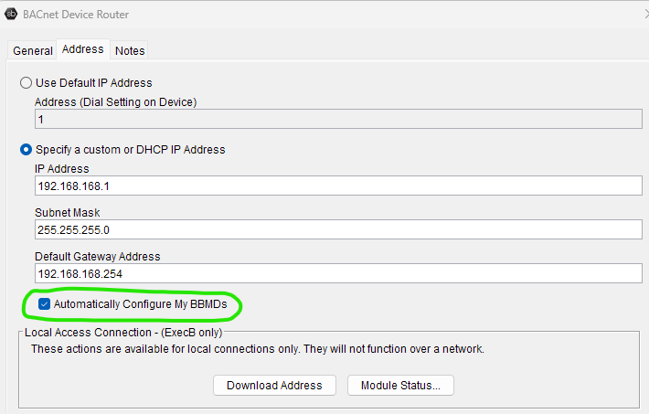
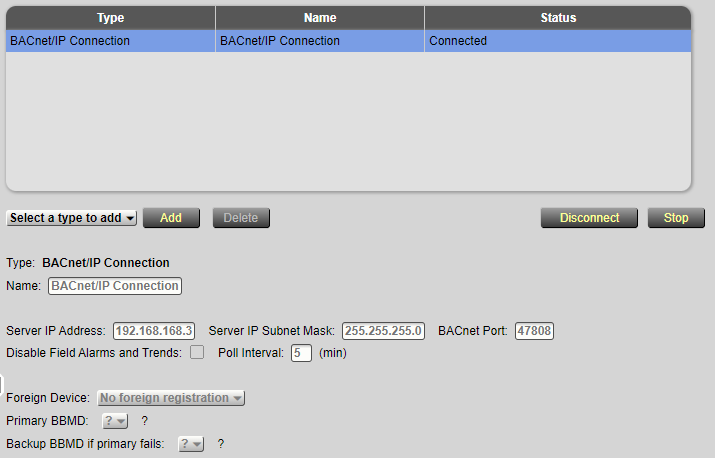
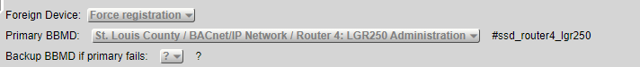
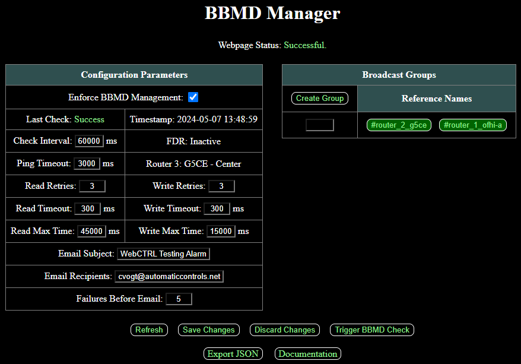
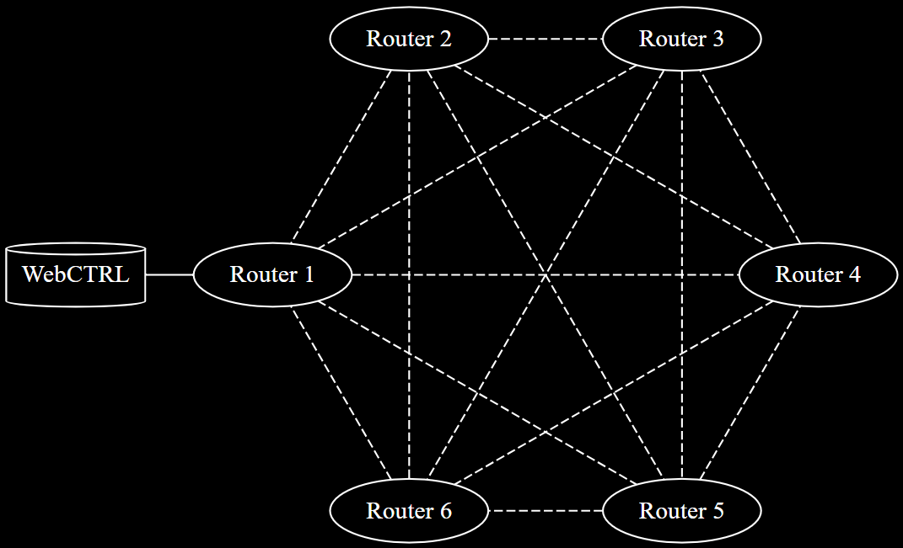
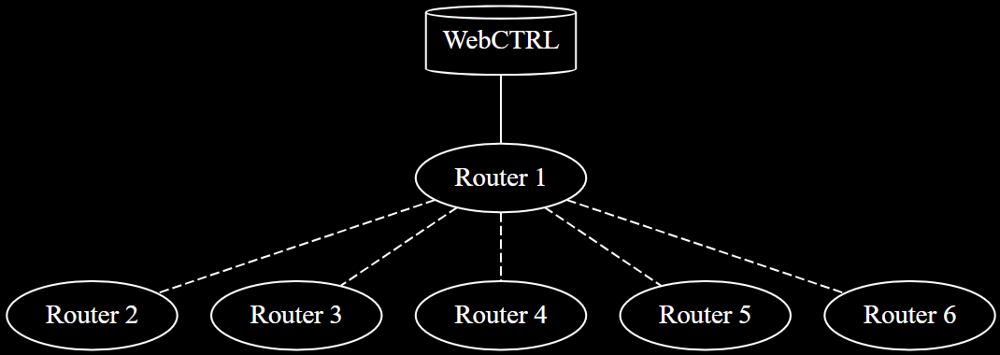
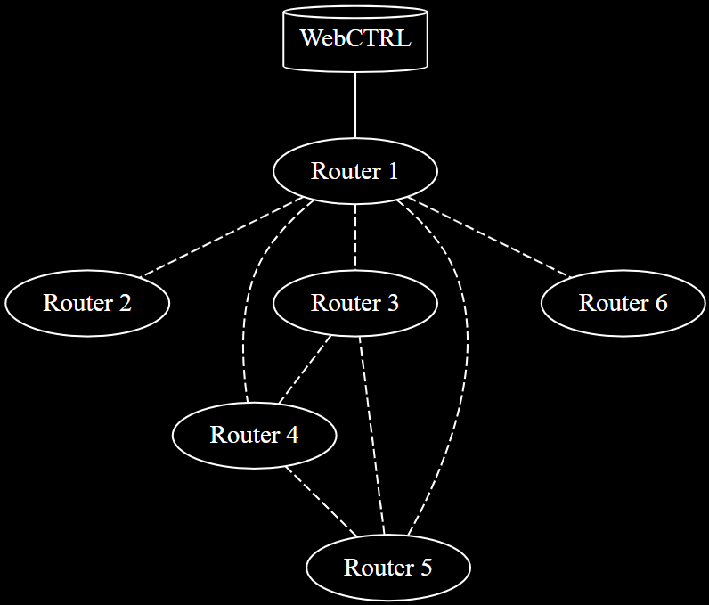

# BBMD Manager

WebCTRL is a trademark of Automated Logic Corporation. Any other trademarks mentioned herein are the property of their respective owners.

This add-on provides an alternative to the automatic BBMD configuration option found in SiteBuilder (shown below).

When activated, this add-on unchecks all the automatic BBMD configuration boxes. The add-on forcibly writes BDTs into each router whenever necessary. The advantage of using this add-on is that it improves network performance by minimizing unnecessary broadcast traffic (we will explain this later). There are a couple pre-requisites for this add-on to work:

- There must be exactly one active BACnet/IP connection, and the server IP address and subnet mask must be populated correctly in the connection details.
- Every top-level IP subnet must have at least one BBMD-capable Automated Logic BACnet/IP router. Subnets consisting of only of third-party routers are not permitted.
- The WebCTRL server should either use FDR or have a router in its own subnet (either option will work). However, secondary FDR failover BBMDs are not *directly* supported.

See the following images for an example of BACnet/IP connection details with and without foreign device registration (FDR).

The add-on will warn you if FDR is improperly configured, but it will not attempt to fix faulty FDR on its own. You may setup email notifications for errors such as this in the add-on's main page as shown below. When you hover your cursor over pieces of the main page (*the actual main page, not the screenshot below*), a little tooltip will popup with documentation describing what each field means.

Now, we explain exactly how this add-on improves network performance. Suppose we have 6 subnets, each with their own router. And suppose the WebCTRL server shares a subnet with **Router 1**. For the purposes of this example, it would also be equivalent to assume the WebCTRL server lives in a 7th subnet, but is registered as a foreign device in **Router 1**. If BBMD autoconfigure is checked in SiteBuilder for every router, the following graph represents the BBMD connections.

Each dotted line represents two BDT entries. For example, the dotted line between **Router 1** and **Router 2** represents a BDT entry in each router. **Router 1** has an entry pointing to the IP address of **Router 2**, and **Router 2** has an entry pointing to the IP address of **Router 1**. This means a broadcast packet received by either router will be forwarded to the other.

Notice that every router can communicate with every other router in the autoconfiguration provided by SiteBuilder. This can cause unnecessary traffic if there are routers which don't need to communicate in any way (e.g, routers controlling buildings located in different states). The only vital connection is a path for every router to communicate to the WebCTRL server. In this case, every router needs to communicate with **Router 1**, and then **Router 1** will pass the broadcast packets to-and-from the WebCTRL server. This minimal BBMD setup is the default configuration provided by this add-on (shown in the graph below).

In this configuration, the WebCTRL server can talk to every router, but the routers cannot talk amongst themselves (with the exception of **Router 1**, of course). This means you could not map a network point in **Router 3** to an address belonging to **Router 4**, for example. If certain routers need to talk with one another, then you can add a broadcast group in the add-on's main page. If you created a broadcast group containing the reference names of routers 3, 4, and 5, then you would get the following BBMD graph.

The add-on enforces this graph by reading all BDTs periodically and fixing those which do not match the expected result. You can see all BDTs at once if you click the **Export JSON** button at the bottom of the main page. Or you can use the manual command `bbmd read` to view the BDT of individual routers.